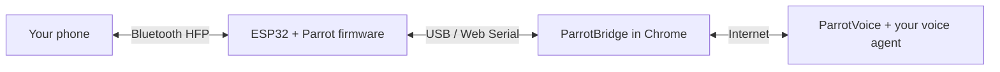

  

# ParrotVoice Firmware

**Connect your voice agent to calls on your own phone number.**

[Website](https://parrotvoice.app) · [Set up your board](https://parrotvoice.app/bridge/) · [Open Console](https://parrotvoice.app/console/) · [Documentation](https://parrotvoice.app/docs/)

ParrotVoice turns an ESP32 board into a Bluetooth hands-free device for your phone. Your voice agent can make and answer calls through that connection, using the phone number and carrier you already have.

This is the **single public project and feedback hub** for the device experience: **ESP32 firmware, the browser bridge, Bluetooth pairing, and calls**. Star this repository to keep it handy, report problems here, and use the shared vote below to tell us you want the project open sourced.

> **Project status:** the product is available through [parrotvoice.app](https://parrotvoice.app). Product source code is not currently published. This repository provides information and public issue tracking; it is not a source release.

## Start with the device

The firmware gives the board its phone connection. ParrotBridge is the browser page that installs that firmware and keeps the board connected to ParrotVoice.

| Part                    | What it does                                                                                | Learn more                                                               |
| ----------------------- | ------------------------------------------------------------------------------------------- | ------------------------------------------------------------------------ |
| **ESP32 firmware**      | Pairs the board with your phone as a hands-free device and carries call audio and controls. | [Board and firmware guide](https://parrotvoice.app/docs/board-firmware/) |
| **ParrotBridge**        | Flashes the board and hosts its connection from a browser tab.                              | [Bridge guide](https://parrotvoice.app/docs/bridge/)                     |
| **ParrotVoice Console** | Configures assistants and lets you manage devices and calls.                                | [Console](https://parrotvoice.app/console/)                              |
| **Agent integration**   | Lets an MCP client use ParrotVoice calling tools.                                           | [MCP guide](https://parrotvoice.app/docs/mcp-integration/)               |

## Your first call

You need a **classic ESP32 / WROOM-32**, a USB data cable, a computer running **desktop Google Chrome**, and a phone with Bluetooth. Check the [board guide](https://parrotvoice.app/docs/board-firmware/) before buying hardware; ESP32-S3, S2, C3, and C6 boards do not support this phone path.

1. Open [ParrotBridge](https://parrotvoice.app/bridge/) in desktop Chrome and connect your board by USB.
2. Follow the setup flow to sign in, name the board, and install its firmware.
3. Connect the board in the bridge, then pair your phone with the Bluetooth name you chose.
4. Open the [Console](https://parrotvoice.app/console/) to configure an assistant and try a call.

**Keep the Bridge tab open, the board plugged in, and the computer awake while using the phone connection.**

For the complete walkthrough, follow [Quickstart: your first call](https://parrotvoice.app/docs/quickstart/).

## What you can do

- **Make calls:** have a voice agent call from your phone, ask questions, and report back.
- **Handle incoming calls:** configure an assistant to answer and collect information.
- **Use your own agent:** connect an MCP client to ParrotVoice calling tools.
- **Review a call:** inspect the call history and results in the Console.

See [Making and receiving calls](https://parrotvoice.app/docs/calling/) and [After the call](https://parrotvoice.app/docs/after-the-call/) for the current behavior and controls.

## One place for feedback

You do not need to know whether a problem belongs to firmware, Bluetooth, the bridge, or the Console before reporting it.

| I want to…                     | Go here                                                                       |
| ------------------------------ | ----------------------------------------------------------------------------- |
| Report a problem               | [Report a bug](https://github.com/ParrotVoiceApp/firmware/issues/1)           |
| Suggest an improvement         | [Open an issue](https://github.com/ParrotVoiceApp/firmware/issues/new/choose) |
| Support an open-source release | [Vote with a 👍](https://github.com/ParrotVoiceApp/firmware/issues/2)         |
| Find an existing report        | [Search issues](https://github.com/ParrotVoiceApp/firmware/issues)            |
| Troubleshoot setup             | [Bridge error codes](https://parrotvoice.app/docs/bridge-errors/)             |

Bug reports should include reproduction steps, what you expected, your board and phone models, and browser and firmware versions when available. If the Bridge shows an error, include its `PB-…` code and review the **Copy diagnostics** output before sharing it. Remove keys, tokens, phone numbers, and other private information.

English and 中文 reports are welcome. Add details to an existing report when it describes the same problem.

## Open-source interest

**[Add a 👍 to the open-source vote](https://github.com/ParrotVoiceApp/firmware/issues/2)** if you would like to inspect, customize, or contribute to the firmware and bridge. Use the same issue for both components so community interest stays together.

Comments about what you would build or contribute are useful too. The vote measures interest; no release date, license, or source-publication commitment has been announced.

## Common questions

**Is this a firmware download or source-code repository?**

No. Use [ParrotBridge](https://parrotvoice.app/bridge/) to install the firmware. Product source code is not published here.

**Do I need to install an app on my phone?**

No phone app is required for the Bluetooth hands-free connection. Setup and hosting happen through the computer's Bridge tab.

**Can I close the Bridge tab after flashing?**

Flashing persists on the board, but the active connection runs in the tab. Closing it or letting the computer sleep takes the line offline.

**How do I update?**

Reload the page for the current browser bridge. Update firmware through the page's re-flash flow when needed. See [Firmware versions and updates](https://parrotvoice.app/docs/board-firmware/#firmware-versions-updates).

**Where should I report a firmware problem?**

Here, in [this repository's Issues](https://github.com/ParrotVoiceApp/firmware/issues). Hardware and bridge feedback share one tracker.

---

[ParrotVoice](https://parrotvoice.app) · [Docs](https://parrotvoice.app/docs/) · [Security and trust](https://parrotvoice.app/docs/security/) · [Privacy](https://parrotvoice.app/docs/privacy/)
